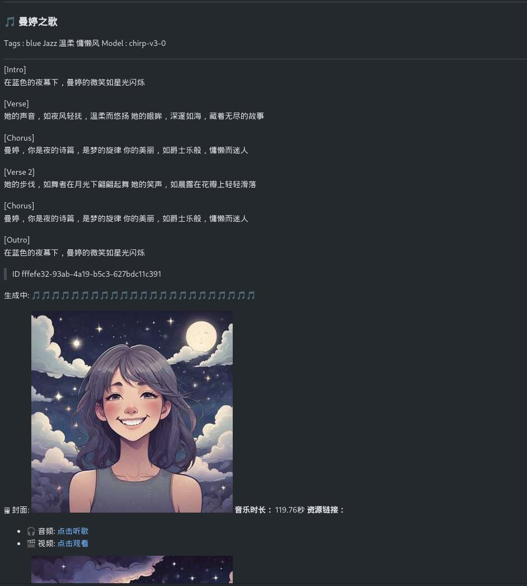

项目基于 [Suno-API](https://github.com/Suno-API/Suno-API?tab=readme-ov-file)  进行了删减，仅保留部分功能

为了适配new-api中转厂商的sunoapi接口，使用 [DeepSeek](https://platform.deepseek.com/) 辅助

返回效果如下:
---

---

> **POST** &emsp;&emsp; {{BASE_URL}}/v1/chat/completions

<code>Authorization</code> 填入对应的中转站申请的sunoapi密钥
```json
{
    "model": "suno-v3",
    "messages": [
      {
        "role": "user",
        "content": "Hello!"
      }
    ]
  }
```

> ENV
```dockerfile
- PORT=9000
- TZ=Asia/Shanghai
- ROTATE_LOGS=false
- PPROF=false
- DEBUG=false
- BASE_URL=https://xxx  #中转url
- CHAT_TEMPLATE_DIR=./template #template位置
- CHAT_OPENAI_MODEL=deepseek-chat # openai model
- CHAT_OPENAI_BASE=https://api.deepseek.com # openai url
- CHAT_OPENAI_KEY=sk-xxx #openai key
```

> docker

修改 [docker-compose.yml](./docker-compose.yml) 环境变量
```shell
docker compose up -d
```